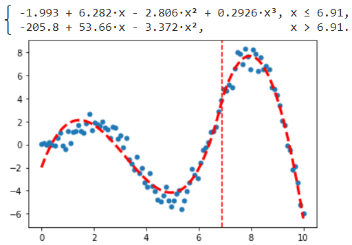
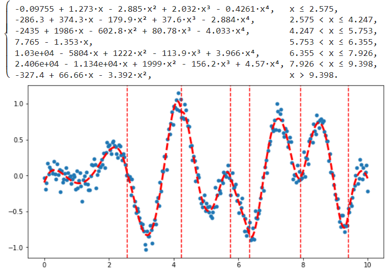

# PWPolynomials
A library for fitting continuous piecewise polynomials of different degrees to data. Just specify the number of line segments you desire and provide the data.

# Features
Estimates one-dimensional piecewise polynomial regression models with variable polynomial degrees, with single or multiple breakpoints.

# Installation

Install via pip from git
```bash
pip install "git+https://github.com/PrefixCoder/pwpolynomials"
```

or by clonning the repo
```bash
git clone "https://github.com/PrefixCoder/pwpolynomials"
pip install ./pwpolynomials
```

# Examples

```python
# Fit piecewise polynomial with single knot
import numpy as np
from matplotlib import pyplot as plt
import pwpolynomials as pwp

# choose polynomials' degrees
p1, p2 = 3, 2

# generate training data
x = np.linspace(0, 10, 100)
err = np.random.normal(0, 0.5, len(x))
y = x*np.sin(x) + err

# train model
pwpoly = pwp.twopolyfit(x, y, p1, p2)
# for degrees higher than 3 
# function pwp.twopolyfit_iterative will give 
# better results, thought it's a little slower

# view model's coefficients
print(pwpoly)

# plot data and resulting polynomials
plt.scatter(x, y, s=25)
plt.plot(x, pwpoly(x), color='r', linewidth=3, linestyle='--')
plt.axvline(x=pwpoly.knots[0], color='red', linestyle='--');
```


```python

# Fit piecewise polynomial with multiple knots
# (number and location of knots is estimated automatically)
import numpy as np
from matplotlib import pyplot as plt
import pwpolynomials as pwp

# choose max degree for segments' polynomials
p = 4

# generate training data
x = np.linspace(0, 10, 300)
err = np.random.normal(0, 0.1, len(x))
y =  np.sin(0.1*x**2)*np.cos(3*x) + err

# train model
pwpoly = pwp.multipolyfit(x, y, p)

# view model in a form of piecewise function
print(pwpoly)

# plot data and resulting polynomials
plt.figure(figsize=(10,5))
plt.scatter(x, y, s=25)
plt.plot(x, pwpoly(x), color='r', linewidth=3, linestyle='--')
for knot in pwpoly.knots:
    plt.axvline(x=knot, color='red', linestyle='--')
```


# License

MIT